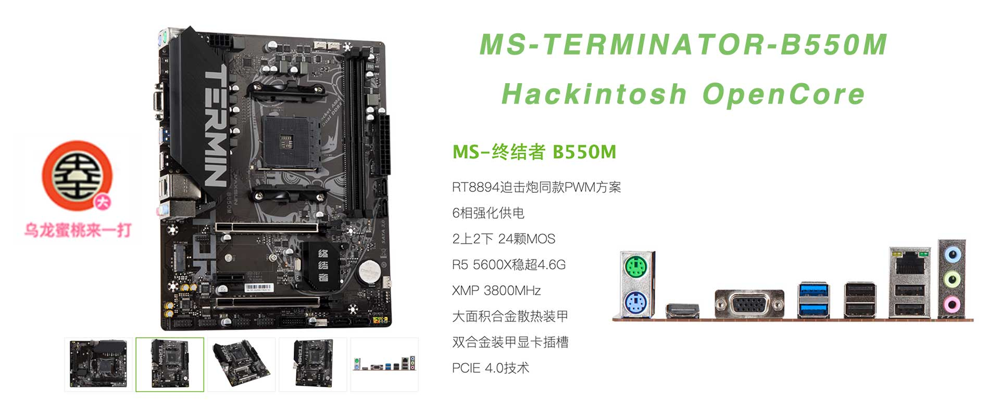

## 铭瑄-终结者 B550M 黑苹果 OpenCore EFI



### OpenCore

[OpenCore 0.9.7](https://github.com/acidanthera/OpenCorePkg)

### macOS

- MacOS BigSur 11.X
- macOS Monterey 12.x
- macOS Ventura  13.x 

### 硬件

- Bios 版本: B4.3G（2023-03-30）
- 处理器: amd ryzen 5 5600
- 内    存: 科赋 8G*2 DDR4 3600MHz
- 硬    盘: 铠侠 KIOXIA EXCERIA G2 1 TB Windows + MacOS
- 独    显: 撼讯 AMD Radeon RX 6600 XT
- 声    卡: 瑞昱 ALC897
- 有线网卡: 瑞昱 8111 千兆
- 无线网卡: BCM94360CS2

### BIOS设置

```

|-- SATA模式选择：AHCI
|-- 高于4G地址解码：开启  
|-- Re-Sizable Bar支持：关闭
|-- EHCI/XHCI Hand-off：开启
|-- 兼容性支持模块支持（CSM）：关闭
|-- 串口：关闭
|-- 尝试安全启动：关闭
```

### 注意事项

 - 安装成功后必须使用 [OpenCore Configurator](https://mackie100projects.altervista.org/opencore-configurator/) 或者 [OCAuxiliaryTools](https://github.com/ic005k/OCAuxiliaryTools) 生成你自己的 SMBIOS

### 联系我们

QQ群: 23304408


### 常用工具

- [Hackintool](https://github.com/headkaze/Hackintool) 
- [OCAuxiliaryTools](https://github.com/ic005k/OCAuxiliaryTools) AKA `OCAT`.
- [OpenCore Configurator](https://mackie100projects.altervista.org/opencore-configurator/) AKA `OCC`.
- [gibMacOS](https://github.com/corpnewt/gibMacOS) Build your own MacOS image.
- [ProperTree](https://github.com/corpnewt/ProperTree) Plist editor.